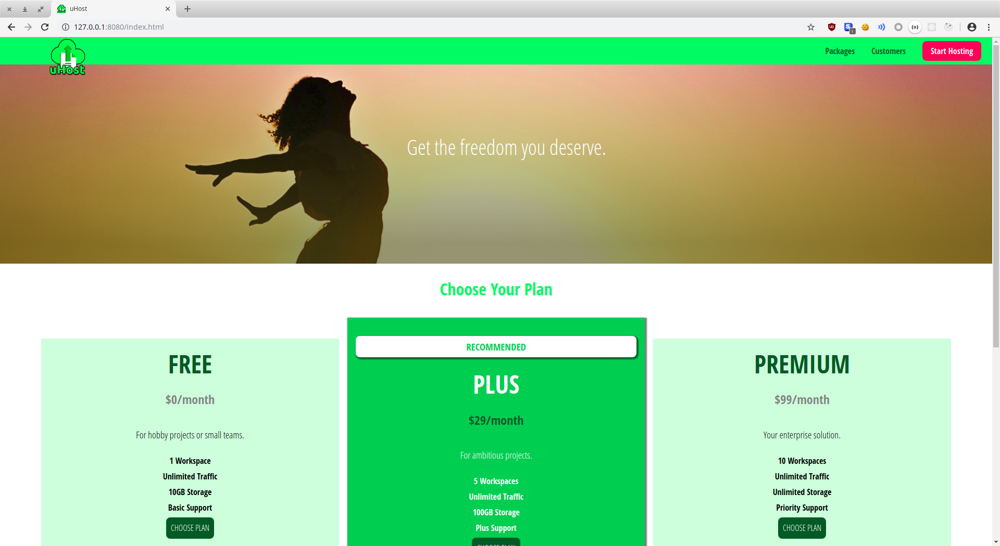
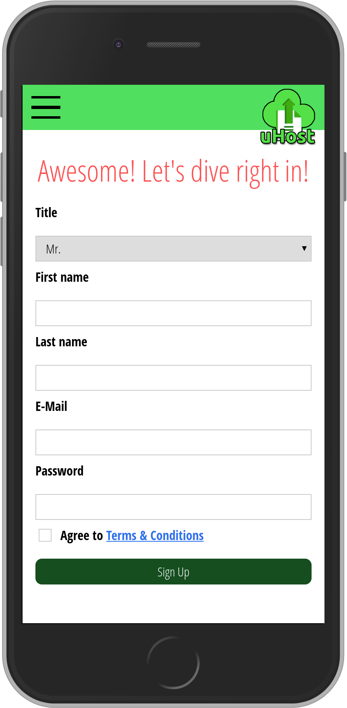

## Work from Udemy course "CSS - The Complete Guide (incl. Flexbox, Grid & Sass)"

#### This repository hosts all my work from the various coding challenges and projects completed while taking this udemy course: https://www.udemy.com/css-the-complete-guide-incl-flexbox-grid-sass/. 

#### From the course you learn:

* The basics about selectors, combinators and how you set up styling rules in general
* Properties, values and decalarations
* How specifity and inheritance work and why it's called "Cascading" Style Sheets
* Important theoretical concepts like the "Box Model"
* How the default position of elements can be changed
* Styling backgrounds (e.g. gradients) and images
* Which units and dimensions you typically use in CSS (px, rem, % and more)
* How JavaScript and CSS interact
* Responsive design and what "Mobile First" means
* Styling forms and form inputs
* Working with text, fonts and text styles
* Flexbox! How it works and how to use it
* Using the CSS Grid and how it differs from Flexbox
* Transforming and animating HTML elements with the help of CSS
* Writing future-proof CSS with features like CSS variables or best-practice class names
* Using Sass and what it actually is all about

#### It's a great course and I highly recommend it!

### Below are two screenshots from the site you build throughout the course, showing both the desktop and mobile view.

#### Homepage in Desktop View

#### Registration Form in Mobile View

